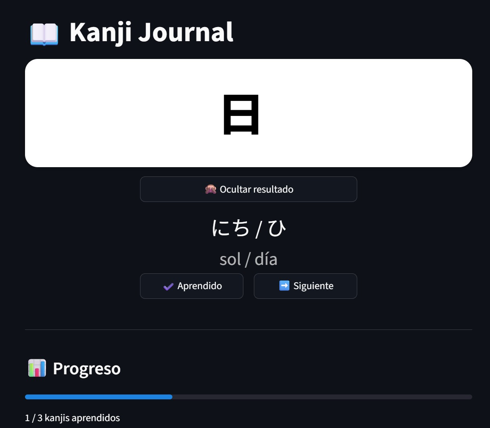

# 📖 Kanji Journal

Interactive kanji learning app built with Streamlit.

---

## 🌐 Live Demo

👉 https://kanji-journal.streamlit.app

---

## 🚀 Features

- Flashcard-style kanji learning
- Show / hide answers
- Progress tracking
- Persistent storage (JSON)

---

## 🧠 Tech Stack

- Python
- Streamlit
- Pandas

---

## 📸 Preview



---

## ▶️ Run locally

```bash
pip install -r requirements.txt
streamlit run app.py